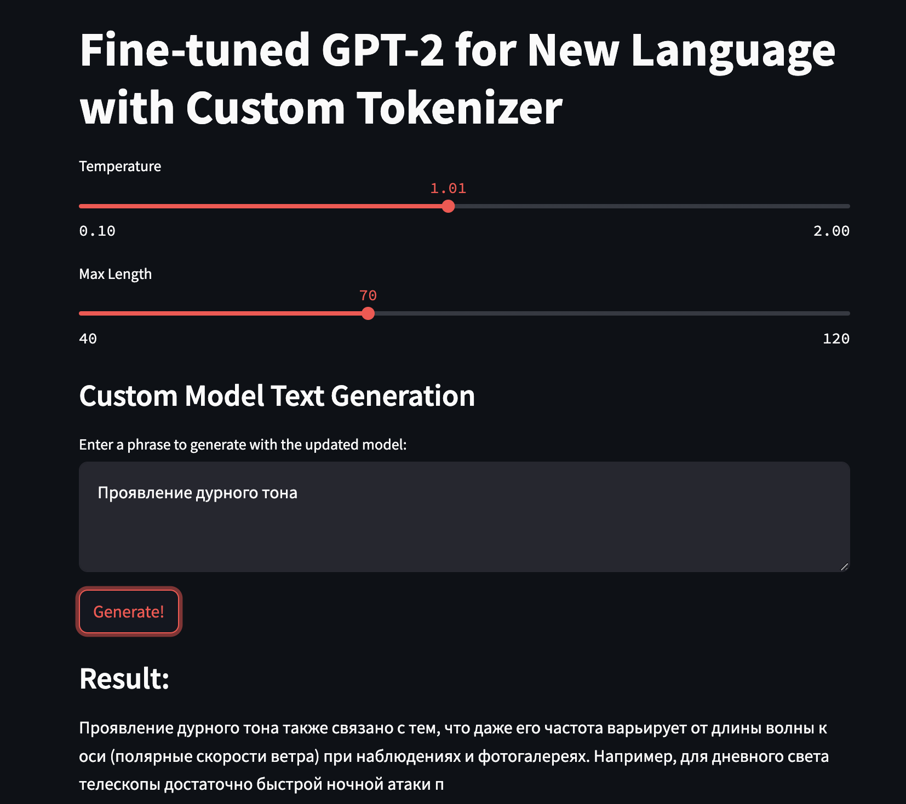

## Fine-Tuning GPT-2 from Scratch with a Custom Tokenizer

## Introduction

This repository explores the process of fine-tuning GPT-2 without relying on pre-trained models for specific languages. Instead, the goal is to dive deep into understanding GPT-2, building an extended tokenizer, and observing the true impact of fine-tuning the model on new text data. By doing this, we can gain valuable insights into the nuances of training large language models and see first-hand how training from scratch or extending a model influences its performance.

## Files

- **File Text_preproc.ipynb: Preprocessing Script**  
  This script handles the preprocessing of multiple text files, ensuring that the data is properly cleaned and formatted for use in the fine-tuning process.

- **Train_LLM.ipynb: Fine-Tuning Script**  
  This script is dedicated to fine-tuning GPT-2. It takes the preprocessed text and runs through the necessary steps to fine-tune the GPT-2 model on new data includinf a custom tokenizer.

- **File Inference_of_fine_tuned_LLM.ipynb: Inference and Further Fine-Tuning**  
  This script is used for generating text with the fine-tuned model (inference) and offers the option to further fine-tune the model with additional data to improve performance.

## Implementation

The full implementation can be found on Hugging Face at [this link](https://huggingface.co/spaces/SaviAnna/Extended_GPT_2). Feel free to explore the details of the training and inference processes there.

---

Let me know if you need any more details!
